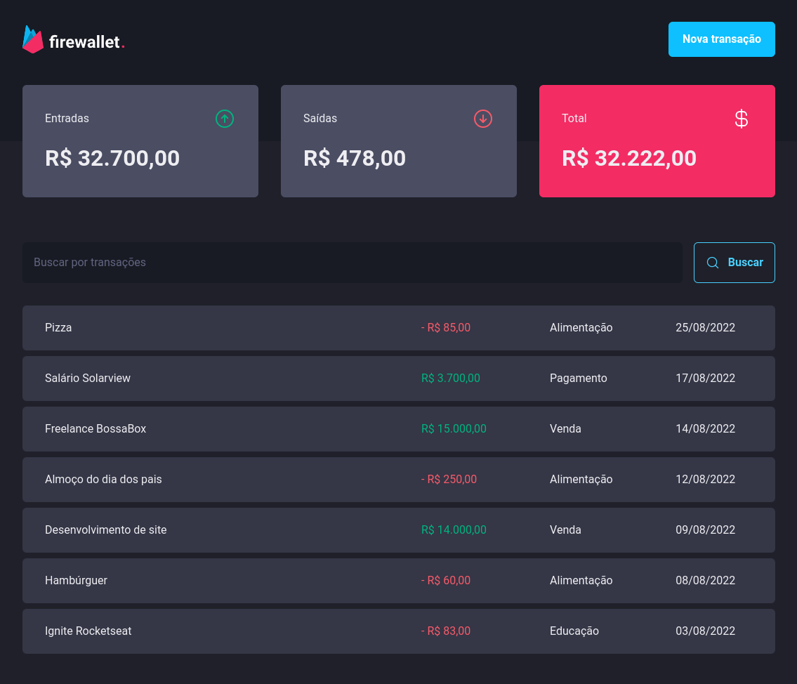
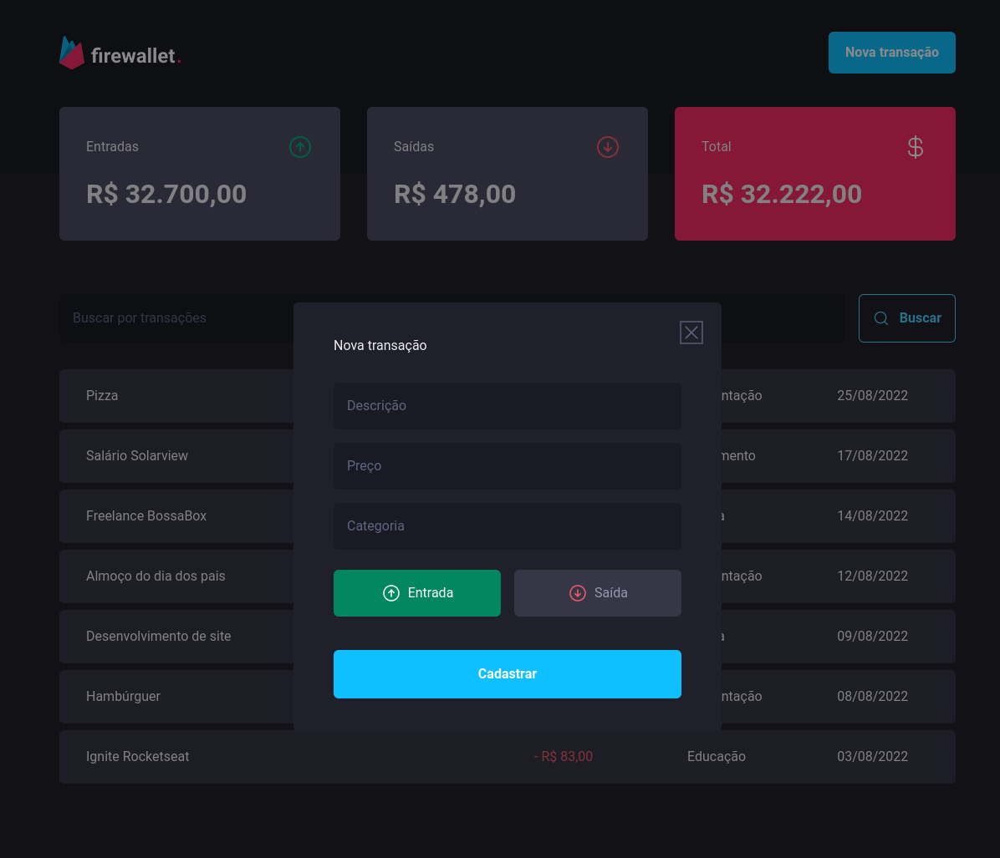
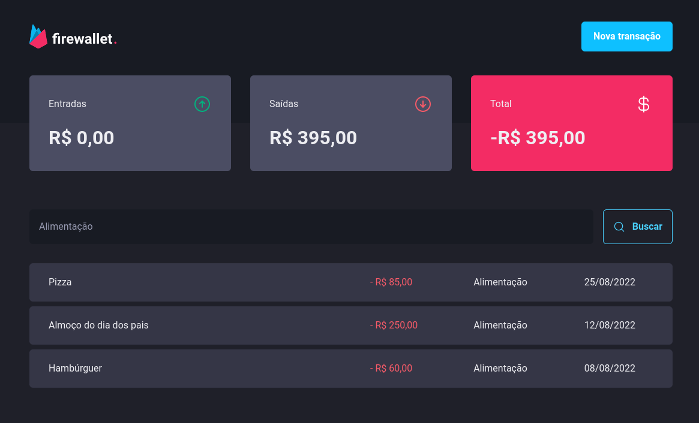

 

## 📄 Descrição

Projeto desenvolvido com intuito de criar uma aplicação de controle de gastos pessoais, feito com ReactJS, ViteJs, ChakraUI, StyledComponents e JSON-Server

## 🛠 Technologies

![react][react] ![vite][vite] ![styled components][styled] ![chakra ui][chakra] ![radix ui][radix] ![json server][jsonserver]

## 📷 Screenshots

## 🦾 Sobre mim

[react]: https://img.shields.io/badge/react%20js-1E4174?style=for-the-badge&logo=react&logoColor=white&labelColor=81D8F7

[vite]: https://img.shields.io/badge/vite%20js-1E4174?style=for-the-badge&logo=vite&logoColor=white&labelColor=FFD028

[styled]: https://img.shields.io/badge/styled%20components-1E4174?style=for-the-badge&logo=styledcomponents&logoColor=white&labelColor=B83280

[chakra]: https://img.shields.io/badge/chakra%20ui-1E4174?style=for-the-badge&logo=chakraui&logoColor=white&labelColor=49D0FF

[radix]: https://img.shields.io/badge/radix%20ui-1E4174?style=for-the-badge&logo=radix-ui&logoColor=white&labelColor=81D8F7

[jsonserver]: https://img.shields.io/badge/json%20server-1E4174?style=for-the-badge&logo=jsonserver&logoColor=white&labelColor=81D8F7

